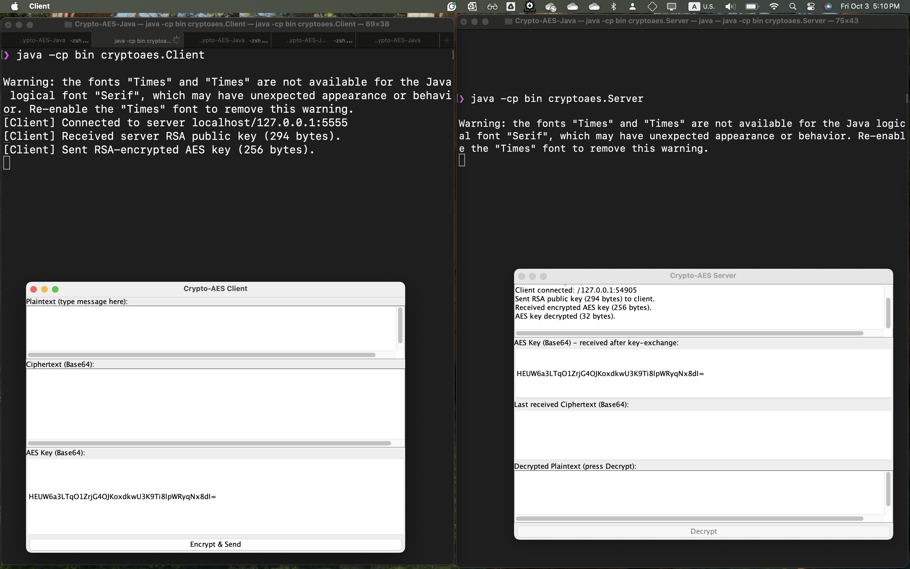

# 🔐 Crypto-AES: A Secure Client-Server Program

A simple Java client-server application demonstrating secure communication using **AES-256** for message encryption and **RSA** for secure AES key exchange.

---

## Overview

This project implements a GUI-based client-server system in Java to demonstrate a hybrid encryption model.
It shows how **symmetric (AES)** and **asymmetric (RSA)** encryption can work together to create a secure channel.

**Key Objectives:**

* Demonstrate the synergy between symmetric and asymmetric encryption.
* Show the full cryptographic cycle: plaintext → ciphertext → decrypted plaintext.
* Provide a GUI for easy verification of encryption and decryption.

---

## Prerequisites

* **Java Development Kit (JDK)** version 11 or higher.
* A terminal or IDE (VS Code, IntelliJ, or Eclipse).
* Basic understanding of Java and network sockets.

---

## Repository Files

| File                       | Description                                                                                    |
| -------------------------- | ---------------------------------------------------------------------------------------------- |
| `Client.java`              | Java Swing GUI client: generates AES key, encrypts messages, sends AES key encrypted with RSA. |
| `Server.java`              | Java Swing GUI server: generates RSA key pair, decrypts AES key, decrypts message.             |
| `RSAKeyPairGenerator.java` | Optional utility to generate RSA keys.                                                         |
| `README.md`                | This documentation.                                                                            |
| `images/`                  | Screenshots of GUI and examples.                                                               |

---

## Design and Flow

**Hybrid Encryption Communication:**

1. **Server RSA Key Pair Generation**

   * Server generates **2048-bit RSA keys** (public/private).
   * Public key is shared with client.

2. **Client AES Key Generation**

   * Client generates **256-bit AES key** for message encryption.

3. **Secure AES Key Exchange**

   * Client encrypts AES key with server's RSA public key.
   * Encrypted AES key sent to server.

4. **Message Encryption**

   * Client encrypts message using AES key (CBC/GCM mode recommended).
   * Sends ciphertext (and IV if used) to server.

5. **Server Decryption**

   * Server decrypts AES key with its RSA private key.
   * Server decrypts ciphertext using AES key.
   * Original plaintext is recovered.

---

## How to Compile and Run

### 1. Compile

```bash
javac -d bin src/cryptoaes/*.java
```

### 2. Run Server

```bash
java -cp bin cryptoaes.Server
```

### 3. Run Client (in separate terminal)

```bash
java -cp bin cryptoaes.Client
```

---

## Step-by-Step Demonstration

### 1. Running Client & Server (Key Exchange)

The client connects to the server, receives the RSA public key, and sends the AES key encrypted with RSA.



---

### 2. Encryption

User types the message `SEC6651` in the client GUI and clicks "Encrypt & Send".
Client encrypts the message and sends ciphertext to server.


---

### 3. Decryption

Server clicks "Decrypt" to reveal the original message using AES key.


---
